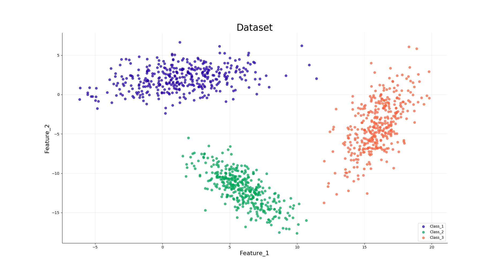

# Bayes Classifier

Bayesian Classifer is a simple and yet a very powerful algorithm. From classifying emails into spam and not spam to face recognition and emotion detection, this algorithm has stood the sands of time by still being a state-of-the-art algorithm. This repository is my take on it to understand its working and visualize its results.

## Just a little bit of theory before we dive into the mud!


* The left hand side term is called ```aposteriori```, it denotes **the probability of class being w (omega) given an input vector x (bar)**. The class corresponding to its maximum is the assigned class for the data point x (bar).
* The first term in numerator of right hand side is called ```likelihood```, means **it is a function of parameters within the parameter space that describes the probability of obtaining the observed data** and is data dependent. This is excatly what we assume to be following Gaussian Distribution.
* The second term in numerator of right hand side is called ```priori```, equates **the probability of class w out of all the classes** and is also data dependent. If it is close to 0 or 1 then all the other terms are useless.
* The denominator on the right hand side is called ```evidence```, it can be viewed as merely a scale factor that guarantees that the ```aposteriori``` probabilities sum to one, as all good probabilities must.

We calculate ```aposteriori``` for each class for a given data point. The one having maximum is considered as the class of that data point.

There are four cases of Bayesian Classifier depending on the type of data:

* ```Case_1:``` Each class of the data has same various.
* ```Case_2:``` Each class of the data has same covariance matrix.
* ```Case_3:``` Each class has different covariance matrices but are diagonal.
* ```Case_4:``` Each class has arbitrarily different covariance matrix.

Although it depends on the data, which case it follows and what types of decision boundaries would the classifier give for it. But we will apply each case to each dataset to see the difference between each case, to study and understand how the classifier works in a better and comprehensive way, to visualize the decision boundaries obtained in each case and to draw insightful inferences from the results. Shall we begin?!

## Application of Bayesian Classifier on different datasets:

### Data_1:

#### First, let's understand our data and visualize its parameters and features using different metrics.



