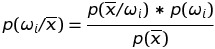

# Bayes Classifier

Bayesian Classifer is a simple and yet a very powerful algorithm. From classifying emails into spam and not spam to face recognition and emotion detection, this algorithm has stood the sands of time by still being a state-of-the-art algorithm. This repository is my take on it to understand its working and visualize its results.

## Just a little bit of theory before we dive into the mud!

* The left hand side term is called ~a-posteriori~